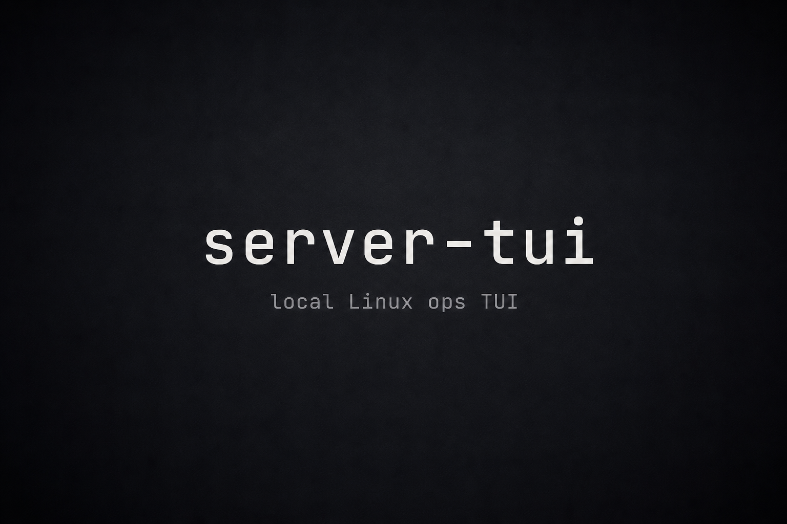

# server-tui

**Local Linux observability in your terminal** — dashboard, processes, systemd, journal, storage, and diagnostics as one binary. No browser, no daemon, no open ports.

[](https://github.com/hatemecha/server-tui/actions/workflows/ci.yml)
[](LICENSE)
[](Cargo.toml)
[](CHANGELOG.md)

<!-- Demo GIF: generate with `vhs docs/assets/demo.tape` when vhs is available; do not link a missing gif. -->

<p align="center">
  
</p>

## Highlights

- **Observe first** — CPU/mem/net, processes, systemd units, journal, storage tree, diagnostics findings
- **Typed admin actions** — SIGTERM/KILL/STOP/CONT and systemctl start/stop/restart/reload/enable/disable with confirmations (default Cancel)
- **Safe defaults** — `--read-only`, `--demo`, redacted support reports, no telemetry
- **Old-server friendly** — `--ascii`, `--no-color`, `--terminal-profile tty16`, `--performance-profile low-resource`

## Status

Early **0.3.x** software for local Linux. Best-effort maintenance by a single maintainer. Not claiming production certification. Prefer `--demo` / `--read-only` when evaluating.

## Install

### Option A — GitHub Release binary (x86_64 Linux)

Download the latest `server-tui-v*-x86_64-unknown-linux-gnu.tar.gz` from
[Releases](https://github.com/hatemecha/server-tui/releases), verify the checksum if provided (`SHA256SUMS`), then:

```bash
tar -xzf server-tui-v0.3.1-x86_64-unknown-linux-gnu.tar.gz
sudo install -m 0755 server-tui-v0.3.1-x86_64-unknown-linux-gnu/server-tui /usr/local/bin/server-tui
server-tui --version
```

Use a user-writable directory (e.g. `~/.local/bin`) instead of `/usr/local/bin` if you prefer not to use `sudo`.

### Option B — build from source (`cargo`)

```bash
cargo install --git https://github.com/hatemecha/server-tui --locked --force
```

`--force` updates an existing `cargo install` of the same binary. That install step needs network access to GitHub and crates.io. The **running** TUI does not phone home (no product telemetry, no HTTP listener).

Ensure `~/.cargo/bin` is on your `PATH`. Verify: `server-tui --version`.

From a checkout: `cargo build --release` then `./scripts/install-local.sh`. More options: [docs/DEPLOYMENT.md](docs/DEPLOYMENT.md).

## Quick start

```bash
server-tui --demo
server-tui --read-only
server-tui doctor --demo
server-tui support --format markdown
server-tui setup console --status
```

Useful flags: `--wallboard`, `--terminal-profile modern|tty16|high-contrast|monochrome`, `--performance-profile low-resource|balanced|responsive`, `--ascii`, `--no-color`.

## Screens

| Key | Screen |
|-----|--------|
| `1` | Dashboard (attention + recent activity; `w` wallboard) |
| `2` | Processes |
| `3` | Services (`s`/`x`/`R`/`u`) |
| `4` | Logs |
| `5` | Storage |
| `6` | Diagnostics |
| `7` | Settings |

See [docs/KEYBINDINGS.md](docs/KEYBINDINGS.md). Glossary: `g`. Help: `?`.

## Safety

- No outbound product telemetry, no HTTP listener, no embedded shell, no automatic privilege escalation
- Service actions require validated unit names **and** known-unit registry membership
- Prefer `--read-only` on shared hosts; admin requires confirmation

## Docs

- [docs/DEPLOYMENT.md](docs/DEPLOYMENT.md) · [docs/KEYBINDINGS.md](docs/KEYBINDINGS.md) · [CHANGELOG.md](CHANGELOG.md) · [ROADMAP.md](ROADMAP.md)
- [SECURITY.md](SECURITY.md) · [SUPPORT.md](SUPPORT.md) · [CONTRIBUTING.md](CONTRIBUTING.md) · [ACKNOWLEDGEMENTS.md](ACKNOWLEDGEMENTS.md)
- Architecture: [ARCHITECTURE.md](ARCHITECTURE.md) · maintainer notes: [docs/MAINTAINING.md](docs/MAINTAINING.md) · [TESTING.md](TESTING.md) · [AGENTS.md](AGENTS.md)

## Ubuntu Server (install only)

```bash
# on the server
curl --proto '=https' --tlsv1.2 -sSf https://sh.rustup.rs | sh
source "$HOME/.cargo/env"
cargo install --git https://github.com/hatemecha/server-tui --locked
server-tui --read-only
```

Do **not** install the startup console unit during validation (`setup console --install` is confirm-gated and refused in smoke). For SSH: run interactively; for a spare TTY, print the unit with `server-tui setup console --print-unit` and review before any manual install.
